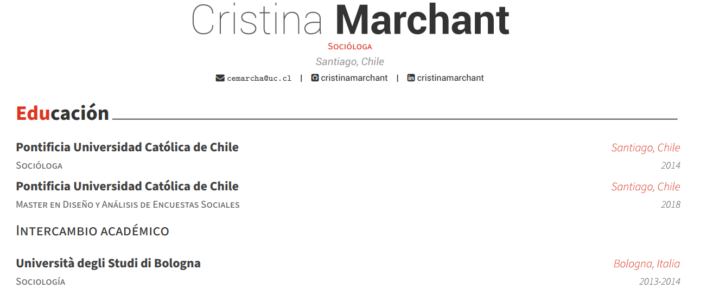

<!-- README.md is generated from README.Rmd. Please edit that file -->

# cv

<!-- badges: start -->

<!-- badges: end -->

El repositorio se creó para tener un curriculum vitae fácil de editar, y
con un diseño agradable desde RMarkdown.

Para esto se utilizó el paquete **vitae**, y específicamente el template
**Awesome-CV format**.

# Uso

En primera instancia se debe instalar el paquete **vitae**, el cual
descargará automáticamente los templates necesarios para crear diversas
versiones de CV.

`install.packages(vitae)` `library(vitae)`

Luego de ello, podemos abrir un nuevo archivo .rmd con el template
deseado. Por ejemplo, en nuestro caso:

File -\> New file -\> R Markdown -\> From Template -\> Awesone-CV format

Esto, cargará automáticamente un archivo .rmd (teniendo como base un CV
de Marie Curie), desde donde se podrán modificar todos los campos
necesarios para crear tu propio CV.

Según tu conveniencia, puedes crear secciones relevantes, con el uso de
headers propio de R Markdown con `#` (por ejemplo, Experiencia Laboral),
y también subsecciones con `##` (por ejemplo, Año X a Año Y).

A continuación se puede ver un ejemplo del uso de secciones y
subsecciones en mi CV personal.

Por último, el template tiene una estructura similar en todas las
secciones, donde se crean *tibbles* con un número determinado de
columnas para mostrar experiencia laboral, formación educativa, etc.
Solo se deben modificar los campos asociados a cada columna. Aquí se
muestra un ejemplo del código utilizado para crear la sección de
Educación de mi CV personal.

`library(tibble)`

`tribble(` `~ Grado, ~ Ano, ~ Institucion, ~ donde,` `"Socióloga",
"2014", "Pontificia Universidad Católica de Chile", "Santiago, Chile",`
`"Master en Diseño y Análisis de Encuestas Sociales", "2018",
"Pontificia Universidad Católica de Chile", "Santiago, Chile") %>%`
`detailed_entries(Grado, Ano, Institucion, donde)`

Eso es todo, crea tu CV como un profesional\!

